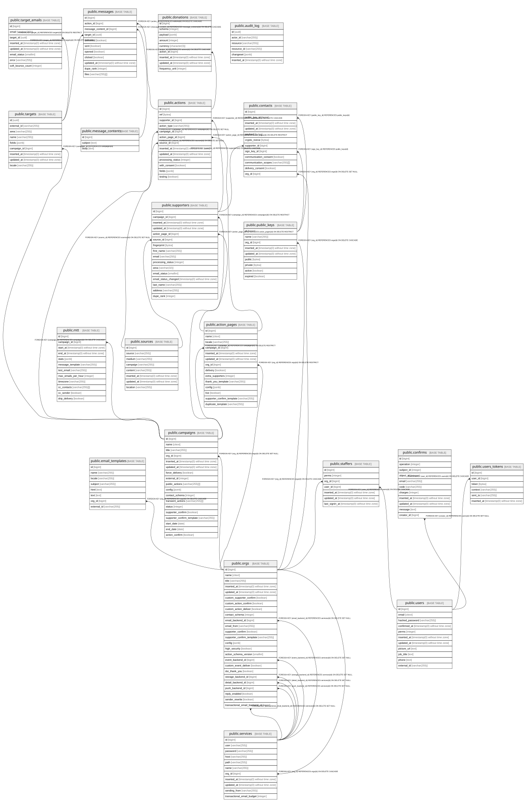

# proca

## Tables

| Name | Columns | Comment | Type |
| ---- | ------- | ------- | ---- |
| [public.orgs](public.orgs.md) | 25 | Organisation (coordinators and partners). Container for campaigns, action pages(widgets), users, services and contacts/supporters data | BASE TABLE |
| [public.campaigns](public.campaigns.md) | 18 | Advocacy campaign. Groups action pages and carries opt-in/delivery behaviour | BASE TABLE |
| [public.action_pages](public.action_pages.md) | 14 | Widget for and org/campaign; usually one per org,campaign,locale (one per webpage) | BASE TABLE |
| [public.supporters](public.supporters.md) | 16 | One submission by a person. Never updated: repeat submissions create new rows linked by fingerprint. No durable PII here - the email/name/address copies are transient, kept while the action is being processed and cleared at delivery; durable PII lives in contacts | BASE TABLE |
| [public.public_keys](public.public_keys.md) | 9 | to encrypt the PII of a contact, owned by an org. One active key at a time, older keys stay for decryption | BASE TABLE |
| [public.contacts](public.contacts.md) | 12 | Per-org supporter's personal data, plus the gdpr consents that org holds. This is where PII is durably retained; supporters only carries a transient copy until delivery | BASE TABLE |
| [public.sources](public.sources.md) | 8 | Deduplicated tracking tuple (utm_*) and widget location, attached to a supporter or action | BASE TABLE |
| [public.staffers](public.staffers.md) | 7 | Membership of a user in an org, with that user's role/permissions in the org | BASE TABLE |
| [public.actions](public.actions.md) | 13 | One action taken through a widget (signature, share, donation, MTT message...) | BASE TABLE |
| [public.services](public.services.md) | 11 | Credentials and endpoint of a remote API an org owns. Referenced from orgs as a particular backend (email, push, storage...) | BASE TABLE |
| [public.confirms](public.confirms.md) | 11 | Pending operation gated by a code, e.g. joining a campaign, launching a page, adding a staffer | BASE TABLE |
| [public.donations](public.donations.md) | 9 | Payment details extracted from a donation action | BASE TABLE |
| [public.users](public.users.md) | 11 | Instance user account; authentication only. Org membership lives in staffers | BASE TABLE |
| [public.users_tokens](public.users_tokens.md) | 6 | Issued session and email tokens for a user | BASE TABLE |
| [public.targets](public.targets.md) | 9 | Campaign target supporters can send MTT messages to (e.g. an MP, a company) | BASE TABLE |
| [public.target_emails](public.target_emails.md) | 8 | Email addresses of a target, with the deliverability state of each address | BASE TABLE |
| [public.message_contents](public.message_contents.md) | 3 | Email subject and body for one MTT action; shared by that action's messages, one per target | BASE TABLE |
| [public.messages](public.messages.md) | 11 | One email to one target, part of an action's MTT | BASE TABLE |
| [public.mtt](public.mtt.md) | 12 | Mail-To-Target configuration of a campaign: schedule and sending limits for supporter emails | BASE TABLE |
| [public.email_templates](public.email_templates.md) | 8 | Named per-org email template used for thank-you, confirm, duplicate and MTT emails | BASE TABLE |
| [public.audit_log](public.audit_log.md) | 6 | Append-only record of privileged changes | BASE TABLE |

## Stored procedures and functions

| Name | ReturnType | Arguments | Type |
| ---- | ------- | ------- | ---- |
| public.citextin | citext | cstring | FUNCTION |
| public.citextout | cstring | citext | FUNCTION |
| public.citextrecv | citext | internal | FUNCTION |
| public.citextsend | bytea | citext | FUNCTION |
| public.citext | citext | character | FUNCTION |
| public.citext | citext | boolean | FUNCTION |
| public.citext | citext | inet | FUNCTION |
| public.citext_eq | bool | citext, citext | FUNCTION |
| public.citext_ne | bool | citext, citext | FUNCTION |
| public.citext_lt | bool | citext, citext | FUNCTION |
| public.citext_le | bool | citext, citext | FUNCTION |
| public.citext_gt | bool | citext, citext | FUNCTION |
| public.citext_ge | bool | citext, citext | FUNCTION |
| public.citext_cmp | int4 | citext, citext | FUNCTION |
| public.citext_hash | int4 | citext | FUNCTION |
| public.citext_smaller | citext | citext, citext | FUNCTION |
| public.citext_larger | citext | citext, citext | FUNCTION |
| public.min | citext | citext | a |
| public.max | citext | citext | a |
| public.texticlike | bool | citext, citext | FUNCTION |
| public.texticnlike | bool | citext, citext | FUNCTION |
| public.texticregexeq | bool | citext, citext | FUNCTION |
| public.texticregexne | bool | citext, citext | FUNCTION |
| public.texticlike | bool | citext, text | FUNCTION |
| public.texticnlike | bool | citext, text | FUNCTION |
| public.texticregexeq | bool | citext, text | FUNCTION |
| public.texticregexne | bool | citext, text | FUNCTION |
| public.regexp_match | _text | string citext, pattern citext | FUNCTION |
| public.regexp_match | _text | string citext, pattern citext, flags text | FUNCTION |
| public.regexp_matches | _text | string citext, pattern citext | FUNCTION |
| public.regexp_matches | _text | string citext, pattern citext, flags text | FUNCTION |
| public.regexp_replace | text | string citext, pattern citext, replacement text | FUNCTION |
| public.regexp_replace | text | string citext, pattern citext, replacement text, flags text | FUNCTION |
| public.regexp_split_to_array | _text | string citext, pattern citext | FUNCTION |
| public.regexp_split_to_array | _text | string citext, pattern citext, flags text | FUNCTION |
| public.regexp_split_to_table | text | string citext, pattern citext | FUNCTION |
| public.regexp_split_to_table | text | string citext, pattern citext, flags text | FUNCTION |
| public.strpos | int4 | citext, citext | FUNCTION |
| public.replace | text | citext, citext, citext | FUNCTION |
| public.split_part | text | citext, citext, integer | FUNCTION |
| public.translate | text | citext, citext, text | FUNCTION |
| public.citext_pattern_lt | bool | citext, citext | FUNCTION |
| public.citext_pattern_le | bool | citext, citext | FUNCTION |
| public.citext_pattern_gt | bool | citext, citext | FUNCTION |
| public.citext_pattern_ge | bool | citext, citext | FUNCTION |
| public.citext_pattern_cmp | int4 | citext, citext | FUNCTION |
| public.citext_hash_extended | int8 | citext, bigint | FUNCTION |

## Relations

---

> Generated by [tbls](https://github.com/k1LoW/tbls)
