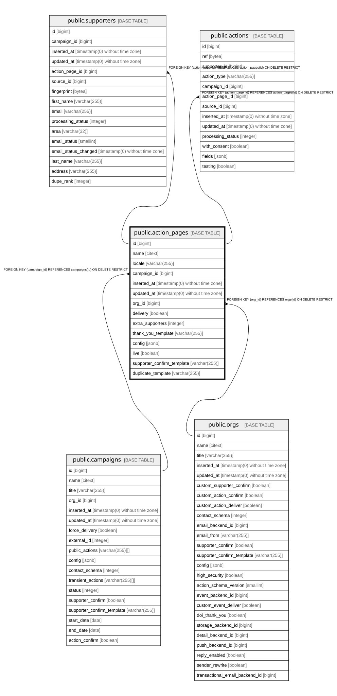

# public.action_pages

## Description

Widget for and org/campaign; usually one per org,campaign,locale (one per webpage)

## Columns

| Name | Type | Default | Nullable | Children | Parents | Comment |
| ---- | ---- | ------- | -------- | -------- | ------- | ------- |
| id | bigint | nextval('action_pages_id_seq'::regclass) | false | [public.supporters](public.supporters.md) [public.actions](public.actions.md) |  |  |
| name | citext |  | false |  |  |  |
| locale | varchar(255) |  | false |  |  |  |
| campaign_id | bigint |  | false |  | [public.campaigns](public.campaigns.md) |  |
| inserted_at | timestamp(0) without time zone |  | false |  |  |  |
| updated_at | timestamp(0) without time zone |  | false |  |  |  |
| org_id | bigint |  | false |  | [public.orgs](public.orgs.md) |  |
| delivery | boolean | true | false |  |  | When the widget's org and the campaign's org differ, whether the widget-owning org is the one that delivers (and so receives the contact with delivery consent). Same-org widgets always deliver |
| extra_supporters | integer | 0 | false |  |  | Offset added to the campaign total, for instance for paper or external campaign tools |
| thank_you_template | varchar(255) |  | true |  |  | Template for the thank-you email; falls back to the campaign/org default |
| config | jsonb | '{}'::jsonb | false |  |  | Free-form widget settings, e.g. journey steps and page texts |
| live | boolean | false | false |  |  | Whether the widget is publicly active |
| supporter_confirm_template | varchar(255) |  | true |  |  | Template for this page's supporter confirmation (DOI) email |
| duplicate_template | varchar(255) |  | true |  |  | Template for the email sent when a supporter repeats an action on this page |

## Constraints

| Name | Type | Definition |
| ---- | ---- | ---------- |
| action_pages_campaign_id_not_null | n | NOT NULL campaign_id |
| action_pages_config_not_null | n | NOT NULL config |
| action_pages_delivery_not_null | n | NOT NULL delivery |
| action_pages_extra_supporters_not_null | n | NOT NULL extra_supporters |
| action_pages_id_not_null | n | NOT NULL id |
| action_pages_inserted_at_not_null | n | NOT NULL inserted_at |
| action_pages_live_not_null | n | NOT NULL live |
| action_pages_locale_not_null | n | NOT NULL locale |
| action_pages_name_not_null | n | NOT NULL name |
| action_pages_org_id_not_null | n | NOT NULL org_id |
| action_pages_updated_at_not_null | n | NOT NULL updated_at |
| action_pages_org_id_fkey | FOREIGN KEY | FOREIGN KEY (org_id) REFERENCES orgs(id) ON DELETE RESTRICT |
| action_pages_campaign_id_fkey | FOREIGN KEY | FOREIGN KEY (campaign_id) REFERENCES campaigns(id) ON DELETE RESTRICT |
| action_pages_pkey | PRIMARY KEY | PRIMARY KEY (id) |

## Indexes

| Name | Definition |
| ---- | ---------- |
| action_pages_pkey | CREATE UNIQUE INDEX action_pages_pkey ON public.action_pages USING btree (id) |
| action_pages_name_index | CREATE UNIQUE INDEX action_pages_name_index ON public.action_pages USING btree (name) |
| action_pages_campaign_id_index | CREATE INDEX action_pages_campaign_id_index ON public.action_pages USING btree (campaign_id) |

## Relations

---

> Generated by [tbls](https://github.com/k1LoW/tbls)
