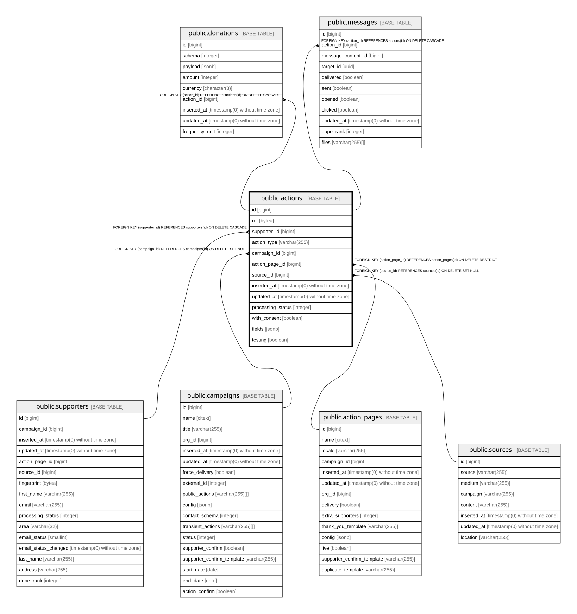

# public.actions

## Description

One action taken through a widget (signature, share, donation, MTT message...)

## Columns

| Name | Type | Default | Nullable | Children | Parents | Comment |
| ---- | ---- | ------- | -------- | -------- | ------- | ------- |
| id | bigint | nextval('actions_id_seq'::regclass) | false | [public.donations](public.donations.md) [public.messages](public.messages.md) |  |  |
| ref | bytea |  | true |  |  | Opaque reference used to attach a supporter to an action created before the personal data was collected |
| supporter_id | bigint |  | true |  | [public.supporters](public.supporters.md) |  |
| action_type | varchar(255) |  | false |  |  | Type of action taken, e.g. sign, share, donate, mtt |
| campaign_id | bigint |  | true |  | [public.campaigns](public.campaigns.md) |  |
| action_page_id | bigint |  | false |  | [public.action_pages](public.action_pages.md) |  |
| source_id | bigint |  | true |  | [public.sources](public.sources.md) |  |
| inserted_at | timestamp(0) without time zone |  | false |  |  |  |
| updated_at | timestamp(0) without time zone |  | false |  |  |  |
| processing_status | integer | 0 | false |  |  | State: 0 new, 1 confirming (awaiting confirmation or moderation), 2 rejected (refused, not delivered), 3 accepted (valid, queued for delivery), 4 delivered (sent downstream), 5 repeat (duplicate action on the same page). Enums.ActionProcessingStatus |
| with_consent | boolean | false | false |  |  | Whether this action carried a communication consent, used when building downstream messages |
| fields | jsonb | '{}'::jsonb | false |  |  | Action-specific custom fields; capped at 5 KB |
| testing | boolean | false | false |  |  | Test submission; excluded from delivery and statistics |

## Constraints

| Name | Type | Definition |
| ---- | ---- | ---------- |
| actions_action_page_id_not_null | n | NOT NULL action_page_id |
| actions_action_type_not_null | n | NOT NULL action_type |
| actions_fields_not_null | n | NOT NULL fields |
| actions_id_not_null | n | NOT NULL id |
| actions_inserted_at_not_null | n | NOT NULL inserted_at |
| actions_processing_status_not_null | n | NOT NULL processing_status |
| actions_testing_not_null | n | NOT NULL testing |
| actions_updated_at_not_null | n | NOT NULL updated_at |
| actions_with_consent_not_null | n | NOT NULL with_consent |
| max_fields_size | CHECK | CHECK ((pg_column_size(fields) <= 5120)) |
| actions_campaign_id_fkey | FOREIGN KEY | FOREIGN KEY (campaign_id) REFERENCES campaigns(id) ON DELETE SET NULL |
| actions_action_page_id_fkey | FOREIGN KEY | FOREIGN KEY (action_page_id) REFERENCES action_pages(id) ON DELETE RESTRICT |
| actions_supporter_id_fkey | FOREIGN KEY | FOREIGN KEY (supporter_id) REFERENCES supporters(id) ON DELETE CASCADE |
| actions_source_id_fkey | FOREIGN KEY | FOREIGN KEY (source_id) REFERENCES sources(id) ON DELETE SET NULL |
| actions_pkey | PRIMARY KEY | PRIMARY KEY (id) |

## Indexes

| Name | Definition |
| ---- | ---------- |
| actions_pkey | CREATE UNIQUE INDEX actions_pkey ON public.actions USING btree (id) |
| actions_action_type_index | CREATE INDEX actions_action_type_index ON public.actions USING btree (action_type) |
| actions_ref_index | CREATE INDEX actions_ref_index ON public.actions USING btree (ref) |
| actions_campaign_id_index | CREATE INDEX actions_campaign_id_index ON public.actions USING btree (campaign_id) |
| actions_processing_status_index | CREATE INDEX actions_processing_status_index ON public.actions USING btree (processing_status) |
| actions_action_page_id_index | CREATE INDEX actions_action_page_id_index ON public.actions USING btree (action_page_id) |
| actions_supporter_id_index | CREATE INDEX actions_supporter_id_index ON public.actions USING btree (supporter_id) |
| actions_partial_processing_status_index | CREATE INDEX actions_partial_processing_status_index ON public.actions USING btree (supporter_id, action_page_id, campaign_id) WHERE (processing_status = ANY (ARRAY[3, 4])) |
| actions_partial_status_inserted_at_index | CREATE INDEX actions_partial_status_inserted_at_index ON public.actions USING btree (processing_status, inserted_at) WHERE testing |
| partial_inserted_at_id_index | CREATE INDEX partial_inserted_at_id_index ON public.actions USING btree (id, inserted_at) WHERE (processing_status = ANY (ARRAY[0, 3])) |

## Relations

---

> Generated by [tbls](https://github.com/k1LoW/tbls)
