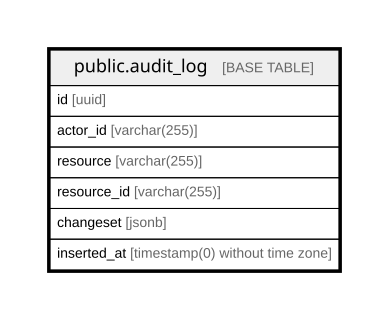

# public.audit_log

## Description

Append-only record of privileged changes

## Columns

| Name | Type | Default | Nullable | Children | Parents | Comment |
| ---- | ---- | ------- | -------- | -------- | ------- | ------- |
| id | uuid |  | false |  |  |  |
| actor_id | varchar(255) |  | false |  |  | Who made the change: a user id or an API client id |
| resource | varchar(255) |  | false |  |  | Type of the changed resource |
| resource_id | varchar(255) |  | false |  |  | Id of the changed resource |
| changeset | jsonb |  | false |  |  | The recorded change, including before/after values |
| inserted_at | timestamp(0) without time zone |  | false |  |  |  |

## Constraints

| Name | Type | Definition |
| ---- | ---- | ---------- |
| audit_log_actor_id_not_null | n | NOT NULL actor_id |
| audit_log_changeset_not_null | n | NOT NULL changeset |
| audit_log_id_not_null | n | NOT NULL id |
| audit_log_inserted_at_not_null | n | NOT NULL inserted_at |
| audit_log_resource_id_not_null | n | NOT NULL resource_id |
| audit_log_resource_not_null | n | NOT NULL resource |
| audit_log_pkey | PRIMARY KEY | PRIMARY KEY (id) |

## Indexes

| Name | Definition |
| ---- | ---------- |
| audit_log_pkey | CREATE UNIQUE INDEX audit_log_pkey ON public.audit_log USING btree (id) |

## Relations

---

> Generated by [tbls](https://github.com/k1LoW/tbls)
