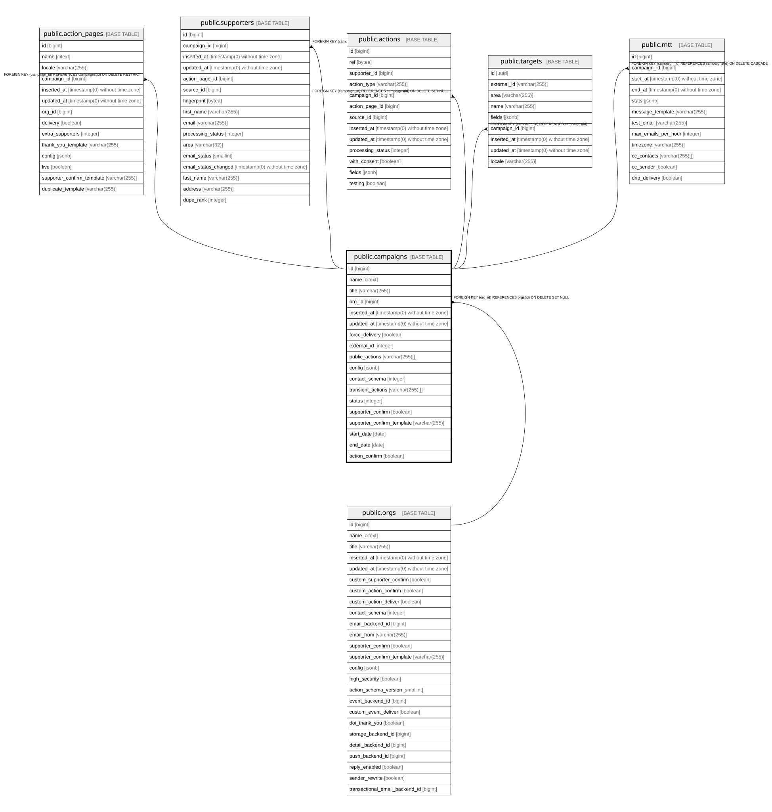

# public.campaigns

## Description

Advocacy campaign. Groups action pages and carries opt-in/delivery behaviour

## Columns

| Name | Type | Default | Nullable | Children | Parents | Comment |
| ---- | ---- | ------- | -------- | -------- | ------- | ------- |
| id | bigint | nextval('campaigns_id_seq'::regclass) | false | [public.action_pages](public.action_pages.md) [public.supporters](public.supporters.md) [public.actions](public.actions.md) [public.targets](public.targets.md) [public.mtt](public.mtt.md) |  |  |
| name | citext |  | false |  |  |  |
| title | varchar(255) |  | false |  |  |  |
| org_id | bigint |  | true |  | [public.orgs](public.orgs.md) |  |
| inserted_at | timestamp(0) without time zone |  | false |  |  |  |
| updated_at | timestamp(0) without time zone |  | false |  |  |  |
| force_delivery | boolean | false | false |  |  | Also deliver the contact to the campaign-owning org when the page-owning org already delivers; without it the lead only receives data when the page does not deliver |
| external_id | integer |  | true |  |  | Id from an external system, used to find and upsert the campaign |
| public_actions | varchar(255)[] | ARRAY[]::character varying[] | false |  |  | Action types whose fields are published with campaign statistics (last actions taken) |
| config | jsonb | '{}'::jsonb | false |  |  | default widget config and locale texts, exposed as `config` in the API |
| contact_schema | integer | 0 | false |  |  | Overrides orgs.contact_schema for this campaign |
| transient_actions | varchar(255)[] | ARRAY[]::character varying[] | false |  |  | Action types whose fields are never stored on the supporter, only passed downstream |
| status | integer | 0 | false |  |  | Lifecycle state: draft/live/closed/ignored (Enums.CampaignStatus) |
| supporter_confirm | boolean |  | true |  |  | Overrides orgs.supporter_confirm; NULL inherits |
| supporter_confirm_template | varchar(255) |  | true |  |  | Overrides orgs.supporter_confirm_template; NULL inherits |
| start_date | date |  | true |  |  | Start of the campaign window |
| end_date | date |  | true |  |  | End of the campaign window |
| action_confirm | boolean |  | true |  |  | Overrides whether actions need confirming; NULL inherits |

## Constraints

| Name | Type | Definition |
| ---- | ---- | ---------- |
| campaigns_config_not_null | n | NOT NULL config |
| campaigns_contact_schema_not_null | n | NOT NULL contact_schema |
| campaigns_force_delivery_not_null | n | NOT NULL force_delivery |
| campaigns_id_not_null | n | NOT NULL id |
| campaigns_inserted_at_not_null | n | NOT NULL inserted_at |
| campaigns_name_not_null | n | NOT NULL name |
| campaigns_public_actions_not_null | n | NOT NULL public_actions |
| campaigns_status_not_null | n | NOT NULL status |
| campaigns_title_not_null | n | NOT NULL title |
| campaigns_transient_actions_not_null | n | NOT NULL transient_actions |
| campaigns_updated_at_not_null | n | NOT NULL updated_at |
| campaigns_org_id_fkey | FOREIGN KEY | FOREIGN KEY (org_id) REFERENCES orgs(id) ON DELETE SET NULL |
| campaigns_pkey | PRIMARY KEY | PRIMARY KEY (id) |

## Indexes

| Name | Definition |
| ---- | ---------- |
| campaigns_pkey | CREATE UNIQUE INDEX campaigns_pkey ON public.campaigns USING btree (id) |
| campaigns_org_id_external_id_index | CREATE UNIQUE INDEX campaigns_org_id_external_id_index ON public.campaigns USING btree (org_id, external_id) |
| campaigns_name_index | CREATE UNIQUE INDEX campaigns_name_index ON public.campaigns USING btree (name) |
| campaigns_start_date_index | CREATE INDEX campaigns_start_date_index ON public.campaigns USING btree (start_date) |
| campaigns_end_date_index | CREATE INDEX campaigns_end_date_index ON public.campaigns USING btree (end_date) |

## Relations

---

> Generated by [tbls](https://github.com/k1LoW/tbls)
