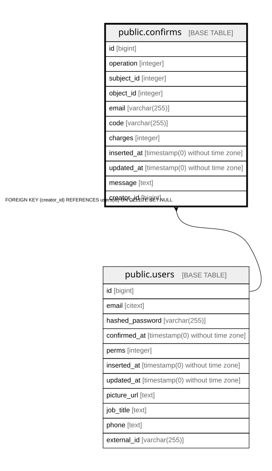

# public.confirms

## Description

Pending operation gated by a code, e.g. joining a campaign, launching a page, adding a staffer

## Columns

| Name | Type | Default | Nullable | Children | Parents | Comment |
| ---- | ---- | ------- | -------- | -------- | ------- | ------- |
| id | bigint | nextval('confirms_id_seq'::regclass) | false |  |  |  |
| operation | integer |  | false |  |  | Operation being confirmed (Enums.ConfirmOperation) |
| subject_id | integer |  | false |  |  | Id of the acting subject, e.g. the org that joined a campaign |
| object_id | integer |  | true |  |  | Id of the object the operation acts on, e.g. the campaign |
| email | varchar(255) |  | true |  |  | If set, the code is sent to this address and may be used without authentication, like a one-time password |
| code | varchar(255) |  | false |  |  | Secret code that accepts or rejects the confirm |
| charges | integer |  | false |  |  | How many times the code may still be used |
| inserted_at | timestamp(0) without time zone |  | false |  |  |  |
| updated_at | timestamp(0) without time zone |  | false |  |  |  |
| message | text |  | true |  |  | Optional message attached to the confirm |
| creator_id | bigint |  | true |  | [public.users](public.users.md) | User who created the confirm |

## Constraints

| Name | Type | Definition |
| ---- | ---- | ---------- |
| confirms_charges_not_null | n | NOT NULL charges |
| confirms_code_not_null | n | NOT NULL code |
| confirms_id_not_null | n | NOT NULL id |
| confirms_inserted_at_not_null | n | NOT NULL inserted_at |
| confirms_operation_not_null | n | NOT NULL operation |
| confirms_subject_id_not_null | n | NOT NULL subject_id |
| confirms_updated_at_not_null | n | NOT NULL updated_at |
| confirms_pkey | PRIMARY KEY | PRIMARY KEY (id) |
| confirms_creator_id_fkey | FOREIGN KEY | FOREIGN KEY (creator_id) REFERENCES users(id) ON DELETE SET NULL |

## Indexes

| Name | Definition |
| ---- | ---------- |
| confirms_pkey | CREATE UNIQUE INDEX confirms_pkey ON public.confirms USING btree (id) |
| confirms_code_index | CREATE UNIQUE INDEX confirms_code_index ON public.confirms USING btree (code) |

## Relations

---

> Generated by [tbls](https://github.com/k1LoW/tbls)
