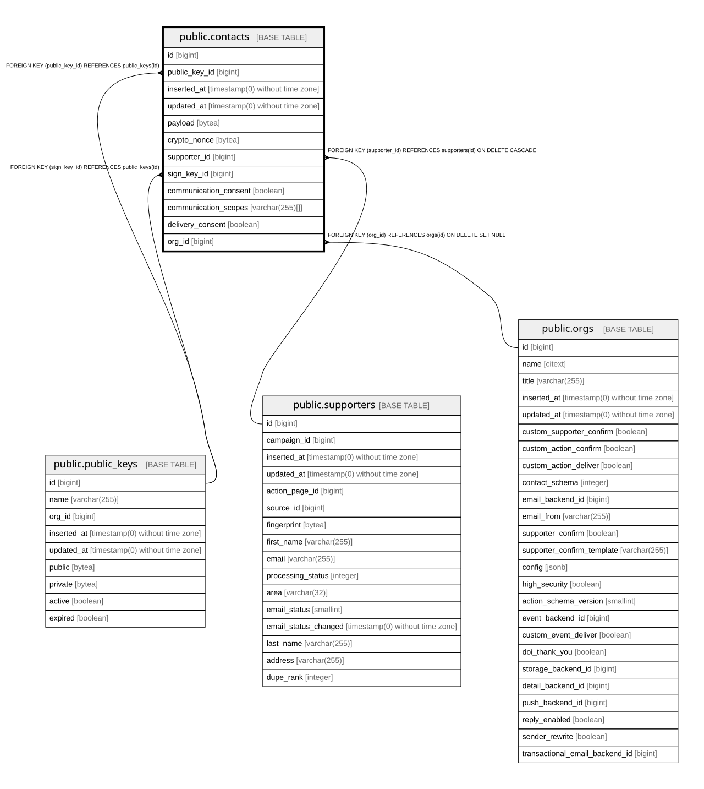

# public.contacts

## Description

Per-org supporter's personal data, plus the gdpr consents that org holds. This is where PII is durably retained; supporters only carries a transient copy until delivery

## Columns

| Name | Type | Default | Nullable | Children | Parents | Comment |
| ---- | ---- | ------- | -------- | -------- | ------- | ------- |
| id | bigint | nextval('contacts_id_seq'::regclass) | false |  |  |  |
| public_key_id | bigint |  | true |  | [public.public_keys](public.public_keys.md) | Key that can decrypt payload (the org's active key at capture time) |
| inserted_at | timestamp(0) without time zone |  | false |  |  |  |
| updated_at | timestamp(0) without time zone |  | false |  |  |  |
| payload | bytea |  | true |  |  | Encrypted personal data; only a holder of the matching key can decrypt it |
| crypto_nonce | bytea |  | true |  |  | Nonce used to encrypt and decrypt payload |
| supporter_id | bigint |  | false |  | [public.supporters](public.supporters.md) |  |
| sign_key_id | bigint |  | true |  | [public.public_keys](public.public_keys.md) | Key that signed the payload; may differ from the encryption key |
| communication_consent | boolean |  | true |  |  | Whether the supporter agreed to receive communication from this org |
| communication_scopes | varchar(255)[] |  | true |  |  | Channels the consent covers; currently only email |
| delivery_consent | boolean | false | false |  |  | Whether the supporter's data was delivered to this org (see action_pages.delivery and campaigns.force_delivery) |
| org_id | bigint |  | true |  | [public.orgs](public.orgs.md) |  |

## Constraints

| Name | Type | Definition |
| ---- | ---- | ---------- |
| contacts_delivery_consent_not_null | n | NOT NULL delivery_consent |
| contacts_id_not_null | n | NOT NULL id |
| contacts_inserted_at_not_null | n | NOT NULL inserted_at |
| contacts_supporter_id_not_null | n | NOT NULL supporter_id |
| contacts_updated_at_not_null | n | NOT NULL updated_at |
| contacts_org_id_fkey | FOREIGN KEY | FOREIGN KEY (org_id) REFERENCES orgs(id) ON DELETE SET NULL |
| contacts_supporter_id_fkey | FOREIGN KEY | FOREIGN KEY (supporter_id) REFERENCES supporters(id) ON DELETE CASCADE |
| contacts_public_key_id_fkey | FOREIGN KEY | FOREIGN KEY (public_key_id) REFERENCES public_keys(id) |
| contacts_sign_key_id_fkey | FOREIGN KEY | FOREIGN KEY (sign_key_id) REFERENCES public_keys(id) |
| contacts_pkey | PRIMARY KEY | PRIMARY KEY (id) |

## Indexes

| Name | Definition |
| ---- | ---------- |
| contacts_pkey | CREATE UNIQUE INDEX contacts_pkey ON public.contacts USING btree (id) |
| contacts_org_id_index | CREATE INDEX contacts_org_id_index ON public.contacts USING btree (org_id) |
| contacts_supporter_id_index | CREATE INDEX contacts_supporter_id_index ON public.contacts USING btree (supporter_id) |

## Relations

---

> Generated by [tbls](https://github.com/k1LoW/tbls)
