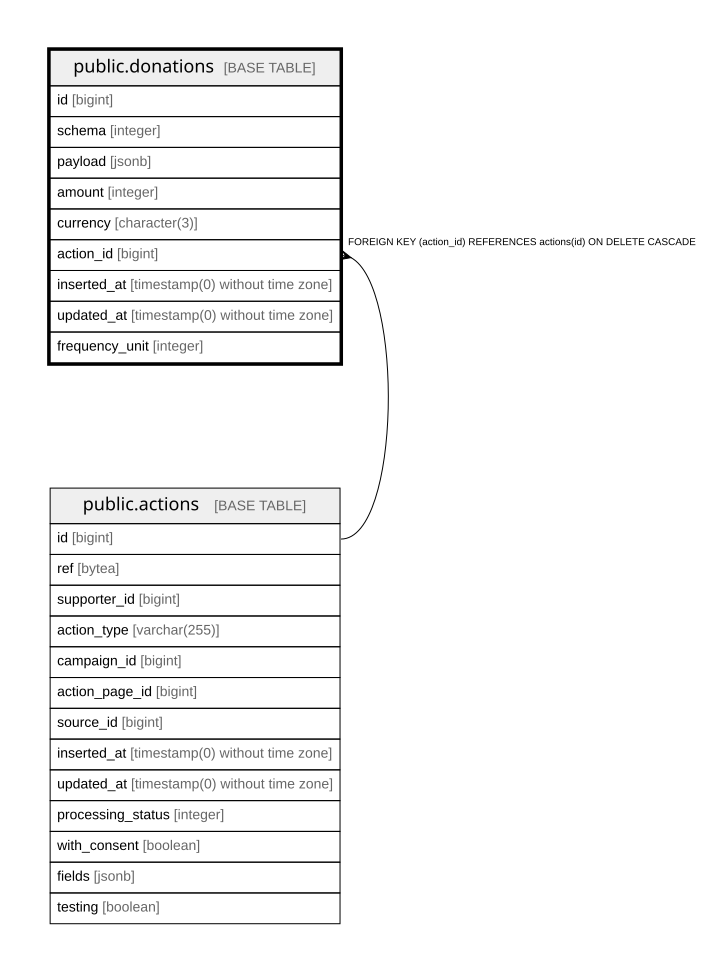

# public.donations

## Description

Payment details extracted from a donation action

## Columns

| Name | Type | Default | Nullable | Children | Parents | Comment |
| ---- | ---- | ------- | -------- | -------- | ------- | ------- |
| id | bigint | nextval('donations_id_seq'::regclass) | false |  |  |  |
| schema | integer |  | true |  |  | How to interpret payload (Enums.DonationSchema) |
| payload | jsonb |  | false |  |  | Raw payment provider object that amount and currency are extracted from |
| amount | integer |  | false |  |  | Amount in the smallest currency unit, e.g. cents |
| currency | character(3) |  | false |  |  | ISO 4217 currency code |
| action_id | bigint |  | false |  | [public.actions](public.actions.md) |  |
| inserted_at | timestamp(0) without time zone |  | false |  |  |  |
| updated_at | timestamp(0) without time zone |  | false |  |  |  |
| frequency_unit | integer | 0 | false |  |  | one_off/weekly/monthly/daily (Enums.DonationFrequencyUnit) |

## Constraints

| Name | Type | Definition |
| ---- | ---- | ---------- |
| donations_action_id_not_null | n | NOT NULL action_id |
| donations_amount_not_null | n | NOT NULL amount |
| donations_currency_not_null | n | NOT NULL currency |
| donations_frequency_unit_not_null | n | NOT NULL frequency_unit |
| donations_id_not_null | n | NOT NULL id |
| donations_inserted_at_not_null | n | NOT NULL inserted_at |
| donations_payload_not_null | n | NOT NULL payload |
| donations_updated_at_not_null | n | NOT NULL updated_at |
| donations_action_id_fkey | FOREIGN KEY | FOREIGN KEY (action_id) REFERENCES actions(id) ON DELETE CASCADE |
| donations_pkey | PRIMARY KEY | PRIMARY KEY (id) |

## Indexes

| Name | Definition |
| ---- | ---------- |
| donations_pkey | CREATE UNIQUE INDEX donations_pkey ON public.donations USING btree (id) |
| donations_action_id_index | CREATE INDEX donations_action_id_index ON public.donations USING btree (action_id) |

## Relations

---

> Generated by [tbls](https://github.com/k1LoW/tbls)
