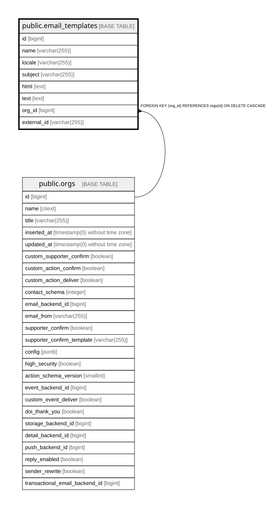

# public.email_templates

## Description

Named per-org email template used for thank-you, confirm, duplicate and MTT emails

## Columns

| Name | Type | Default | Nullable | Children | Parents | Comment |
| ---- | ---- | ------- | -------- | -------- | ------- | ------- |
| id | bigint | nextval('email_templates_id_seq'::regclass) | false |  |  |  |
| name | varchar(255) |  | false |  |  |  |
| locale | varchar(255) |  | false |  |  |  |
| subject | varchar(255) |  | false |  |  |  |
| html | text |  | false |  |  |  |
| text | text |  | true |  |  |  |
| org_id | bigint |  | false |  | [public.orgs](public.orgs.md) |  |
| external_id | varchar(255) |  | true |  |  | Template id at the external provider; when set, the provider template is used instead of local html/subject/text |

## Constraints

| Name | Type | Definition |
| ---- | ---- | ---------- |
| email_templates_html_not_null | n | NOT NULL html |
| email_templates_id_not_null | n | NOT NULL id |
| email_templates_locale_not_null | n | NOT NULL locale |
| email_templates_name_not_null | n | NOT NULL name |
| email_templates_org_id_not_null | n | NOT NULL org_id |
| email_templates_subject_not_null | n | NOT NULL subject |
| email_templates_org_id_fkey | FOREIGN KEY | FOREIGN KEY (org_id) REFERENCES orgs(id) ON DELETE CASCADE |
| email_templates_pkey | PRIMARY KEY | PRIMARY KEY (id) |

## Indexes

| Name | Definition |
| ---- | ---------- |
| email_templates_pkey | CREATE UNIQUE INDEX email_templates_pkey ON public.email_templates USING btree (id) |
| email_templates_org_id_name_locale_index | CREATE UNIQUE INDEX email_templates_org_id_name_locale_index ON public.email_templates USING btree (org_id, name, locale) |

## Relations

---

> Generated by [tbls](https://github.com/k1LoW/tbls)
