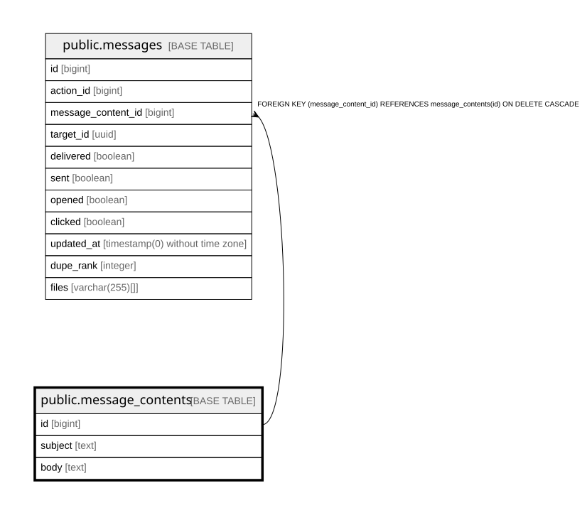

# public.message_contents

## Description

Email subject and body for one MTT action; shared by that action's messages, one per target

## Columns

| Name | Type | Default | Nullable | Children | Parents | Comment |
| ---- | ---- | ------- | -------- | -------- | ------- | ------- |
| id | bigint | nextval('message_contents_id_seq'::regclass) | false | [public.messages](public.messages.md) |  |  |
| subject | text | ''::text | false |  |  | Subject template, with supporter/target merge fields |
| body | text | ''::text | false |  |  | Body template, with supporter/target merge fields |

## Constraints

| Name | Type | Definition |
| ---- | ---- | ---------- |
| message_contents_body_not_null | n | NOT NULL body |
| message_contents_id_not_null | n | NOT NULL id |
| message_contents_subject_not_null | n | NOT NULL subject |
| message_contents_pkey | PRIMARY KEY | PRIMARY KEY (id) |

## Indexes

| Name | Definition |
| ---- | ---------- |
| message_contents_pkey | CREATE UNIQUE INDEX message_contents_pkey ON public.message_contents USING btree (id) |

## Relations

---

> Generated by [tbls](https://github.com/k1LoW/tbls)
