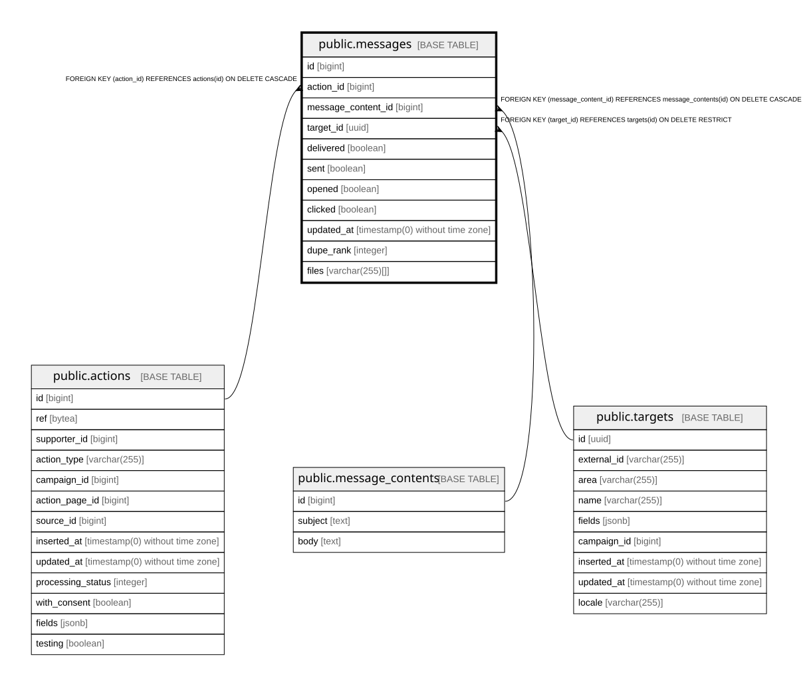

# public.messages

## Description

One email to one target, part of an action's MTT

## Columns

| Name | Type | Default | Nullable | Children | Parents | Comment |
| ---- | ---- | ------- | -------- | -------- | ------- | ------- |
| id | bigint | nextval('messages_id_seq'::regclass) | false |  |  |  |
| action_id | bigint |  | false |  | [public.actions](public.actions.md) |  |
| message_content_id | bigint |  | false |  | [public.message_contents](public.message_contents.md) |  |
| target_id | uuid |  | false |  | [public.targets](public.targets.md) |  |
| delivered | boolean | false | false |  |  | Whether the provider accepted the message for delivery |
| sent | boolean | false | false |  |  | Whether Proca has already sent it; used to pick up unsent messages |
| opened | boolean | false | false |  |  | Whether the recipient opened the email, from provider webhooks |
| clicked | boolean | false | false |  |  | Whether the recipient clicked in the email, from provider webhooks |
| updated_at | timestamp(0) without time zone |  | false |  |  |  |
| dupe_rank | integer |  | true |  |  | 0 for the first message by this supporter to this target, N for later duplicates; used to avoid re-mailing targets |
| files | varchar(255)[] | ARRAY[]::character varying[] | false |  |  | Attached file keys in the org's storage backend |

## Constraints

| Name | Type | Definition |
| ---- | ---- | ---------- |
| messages_action_id_not_null | n | NOT NULL action_id |
| messages_clicked_not_null | n | NOT NULL clicked |
| messages_delivered_not_null | n | NOT NULL delivered |
| messages_files_not_null | n | NOT NULL files |
| messages_id_not_null | n | NOT NULL id |
| messages_message_content_id_not_null | n | NOT NULL message_content_id |
| messages_opened_not_null | n | NOT NULL opened |
| messages_sent_not_null | n | NOT NULL sent |
| messages_target_id_not_null | n | NOT NULL target_id |
| messages_updated_at_not_null | n | NOT NULL updated_at |
| messages_action_id_fkey | FOREIGN KEY | FOREIGN KEY (action_id) REFERENCES actions(id) ON DELETE CASCADE |
| messages_target_id_fkey | FOREIGN KEY | FOREIGN KEY (target_id) REFERENCES targets(id) ON DELETE RESTRICT |
| messages_message_content_id_fkey | FOREIGN KEY | FOREIGN KEY (message_content_id) REFERENCES message_contents(id) ON DELETE CASCADE |
| messages_pkey | PRIMARY KEY | PRIMARY KEY (id) |

## Indexes

| Name | Definition |
| ---- | ---------- |
| messages_pkey | CREATE UNIQUE INDEX messages_pkey ON public.messages USING btree (id) |
| messages_partial_action_index | CREATE INDEX messages_partial_action_index ON public.messages USING btree (action_id) |
| messages_action_id_index | CREATE INDEX messages_action_id_index ON public.messages USING btree (action_id) WHERE (NOT sent) |
| messages_dupe_rank_null_index | CREATE INDEX messages_dupe_rank_null_index ON public.messages USING btree (action_id) WHERE (dupe_rank IS NULL) |
| messages_target_id_dupe_rank_sent_id_index | CREATE INDEX messages_target_id_dupe_rank_sent_id_index ON public.messages USING btree (target_id, dupe_rank, sent, id) |

## Relations

---

> Generated by [tbls](https://github.com/k1LoW/tbls)
