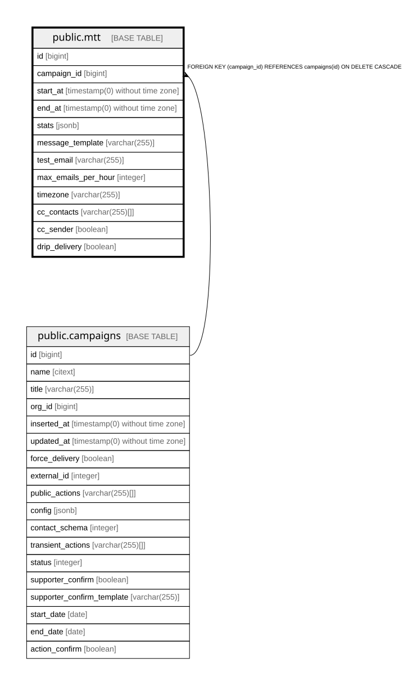

# public.mtt

## Description

Mail-To-Target configuration of a campaign: schedule and sending limits for supporter emails

## Columns

| Name | Type | Default | Nullable | Children | Parents | Comment |
| ---- | ---- | ------- | -------- | -------- | ------- | ------- |
| id | bigint | nextval('mtt_id_seq'::regclass) | false |  |  |  |
| campaign_id | bigint |  | false |  | [public.campaigns](public.campaigns.md) |  |
| start_at | timestamp(0) without time zone |  | false |  |  | Start of the window in which emails may be sent |
| end_at | timestamp(0) without time zone |  | false |  |  | End of the window in which emails may be sent |
| stats | jsonb | '{}'::jsonb | false |  |  | Aggregated send statistics for this MTT |
| message_template | varchar(255) |  | true |  |  | Template used for MTT emails; when unset, the raw action text is sent |
| test_email | varchar(255) |  | true |  |  | Address test MTT actions are sent to instead of the real targets |
| max_emails_per_hour | integer |  | true |  |  | Throttle on outbound emails for this MTT |
| timezone | varchar(255) | 'Etc/UTC'::character varying | false |  |  | Timezone used to interpret the send window and drip schedule |
| cc_contacts | varchar(255)[] | ARRAY[]::character varying[] | false |  |  | Addresses copied on every MTT email |
| cc_sender | boolean | false | false |  |  | Also copy the supporter's own address on the email |
| drip_delivery | boolean | true | true |  |  | Spread emails over the window instead of sending them all at the start |

## Constraints

| Name | Type | Definition |
| ---- | ---- | ---------- |
| mtt_campaign_id_not_null | n | NOT NULL campaign_id |
| mtt_cc_contacts_not_null | n | NOT NULL cc_contacts |
| mtt_cc_sender_not_null | n | NOT NULL cc_sender |
| mtt_end_at_not_null | n | NOT NULL end_at |
| mtt_id_not_null | n | NOT NULL id |
| mtt_start_at_not_null | n | NOT NULL start_at |
| mtt_stats_not_null | n | NOT NULL stats |
| mtt_timezone_not_null | n | NOT NULL timezone |
| mtt_campaign_id_fkey | FOREIGN KEY | FOREIGN KEY (campaign_id) REFERENCES campaigns(id) ON DELETE CASCADE |
| mtt_pkey | PRIMARY KEY | PRIMARY KEY (id) |

## Indexes

| Name | Definition |
| ---- | ---------- |
| mtt_pkey | CREATE UNIQUE INDEX mtt_pkey ON public.mtt USING btree (id) |

## Relations

---

> Generated by [tbls](https://github.com/k1LoW/tbls)
