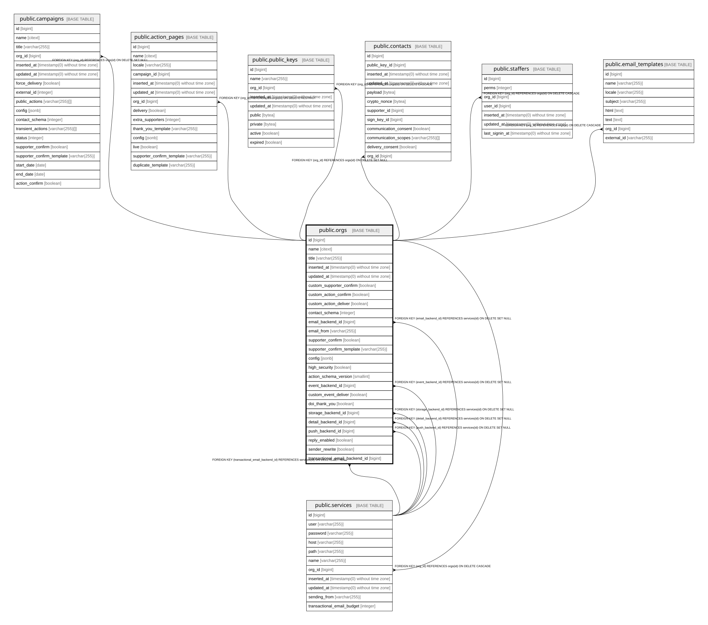

# public.orgs

## Description

Organisation (coordinators and partners). Container for campaigns, action pages(widgets), users, services and contacts/supporters data

## Columns

| Name | Type | Default | Nullable | Children | Parents | Comment |
| ---- | ---- | ------- | -------- | -------- | ------- | ------- |
| id | bigint | nextval('orgs_id_seq'::regclass) | false | [public.campaigns](public.campaigns.md) [public.action_pages](public.action_pages.md) [public.public_keys](public.public_keys.md) [public.contacts](public.contacts.md) [public.staffers](public.staffers.md) [public.services](public.services.md) [public.email_templates](public.email_templates.md) |  |  |
| name | citext |  | false |  |  |  |
| title | varchar(255) |  | false |  |  |  |
| inserted_at | timestamp(0) without time zone |  | false |  |  |  |
| updated_at | timestamp(0) without time zone |  | false |  |  |  |
| custom_supporter_confirm | boolean | false | false |  |  | Route supporter confirmation via this org's cus.* queue for external/custom gdpr validation workflow |
| custom_action_confirm | boolean | false | false |  |  | Route action confirmation via this org's cus.* queue instead of the default queue |
| custom_action_deliver | boolean | false | false |  |  | deliver actions to the org CRM cus.* queue |
| contact_schema | integer | 0 | false |  |  | Contact data shape collected for this org (Enums.ContactSchema); decides which PII fields exist |
| email_backend_id | bigint |  | true |  | [public.services](public.services.md) |  |
| email_from | varchar(255) |  | true |  |  | Default From address for this org's emails |
| supporter_confirm | boolean | false | false |  |  | Require double opt-in before a supporter is treated as active |
| supporter_confirm_template | varchar(255) |  | true |  |  | Email template used for the supporter confirmation message |
| config | jsonb | '{}'::jsonb | false |  |  | Free-form settings, e.g. config["reminder"] configures DOI reminder emails |
| high_security | boolean | false | false |  |  | Never store transient action fields on the supporter record; only the org holding the contact key may keep them, can break features! |
| action_schema_version | smallint | 2 | false |  |  | Proca action payload format this org uses. 2 for everyone for now |
| event_backend_id | bigint |  | true |  | [public.services](public.services.md) |  |
| custom_event_deliver | boolean | false | false |  |  | deliver events to the CRM cus.* queue |
| doi_thank_you | boolean | false | false |  |  | Only send the thank-you email when the supporter gdpr opt-in |
| storage_backend_id | bigint |  | true |  | [public.services](public.services.md) |  |
| detail_backend_id | bigint |  | true |  | [public.services](public.services.md) |  |
| push_backend_id | bigint |  | true |  | [public.services](public.services.md) |  |
| reply_enabled | boolean | true | true |  |  | Add a Reply-To header to mtt sent for this org's campaigns |
| sender_rewrite | boolean | true | true |  |  | Rewrite the envelope sender onto the backend's sending_from domain (SRS); disable for cleaner confirmation emails |
| transactional_email_backend_id | bigint |  | true |  | [public.services](public.services.md) | Backend for transactional (non-MTT) email; falls back to email_backend. Capped by services.transactional_email_budget |

## Constraints

| Name | Type | Definition |
| ---- | ---- | ---------- |
| orgs_action_schema_version_not_null | n | NOT NULL action_schema_version |
| orgs_config_not_null | n | NOT NULL config |
| orgs_contact_schema_not_null | n | NOT NULL contact_schema |
| orgs_custom_action_confirm_not_null | n | NOT NULL custom_action_confirm |
| orgs_custom_action_deliver_not_null | n | NOT NULL custom_action_deliver |
| orgs_custom_event_deliver_not_null | n | NOT NULL custom_event_deliver |
| orgs_custom_supporter_confirm_not_null | n | NOT NULL custom_supporter_confirm |
| orgs_doi_thank_you_not_null | n | NOT NULL doi_thank_you |
| orgs_email_opt_in_not_null | n | NOT NULL supporter_confirm |
| orgs_high_security_not_null | n | NOT NULL high_security |
| orgs_id_not_null | n | NOT NULL id |
| orgs_inserted_at_not_null | n | NOT NULL inserted_at |
| orgs_name_not_null | n | NOT NULL name |
| orgs_title_not_null | n | NOT NULL title |
| orgs_updated_at_not_null | n | NOT NULL updated_at |
| orgs_pkey | PRIMARY KEY | PRIMARY KEY (id) |
| orgs_detail_backend_id_fkey | FOREIGN KEY | FOREIGN KEY (detail_backend_id) REFERENCES services(id) ON DELETE SET NULL |
| orgs_email_backend_id_fkey | FOREIGN KEY | FOREIGN KEY (email_backend_id) REFERENCES services(id) ON DELETE SET NULL |
| orgs_event_backend_id_fkey | FOREIGN KEY | FOREIGN KEY (event_backend_id) REFERENCES services(id) ON DELETE SET NULL |
| orgs_push_backend_id_fkey | FOREIGN KEY | FOREIGN KEY (push_backend_id) REFERENCES services(id) ON DELETE SET NULL |
| orgs_storage_backend_id_fkey | FOREIGN KEY | FOREIGN KEY (storage_backend_id) REFERENCES services(id) ON DELETE SET NULL |
| orgs_transactional_email_backend_id_fkey | FOREIGN KEY | FOREIGN KEY (transactional_email_backend_id) REFERENCES services(id) ON DELETE SET NULL |

## Indexes

| Name | Definition |
| ---- | ---------- |
| orgs_pkey | CREATE UNIQUE INDEX orgs_pkey ON public.orgs USING btree (id) |
| orgs_name_index | CREATE UNIQUE INDEX orgs_name_index ON public.orgs USING btree (name) |

## Relations

---

> Generated by [tbls](https://github.com/k1LoW/tbls)
