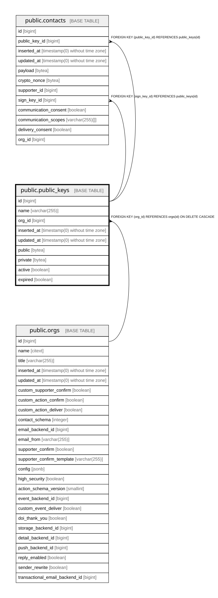

# public.public_keys

## Description

to encrypt the PII of a contact, owned by an org. One active key at a time, older keys stay for decryption

## Columns

| Name | Type | Default | Nullable | Children | Parents | Comment |
| ---- | ---- | ------- | -------- | -------- | ------- | ------- |
| id | bigint | nextval('public_keys_id_seq'::regclass) | false | [public.contacts](public.contacts.md) |  |  |
| name | varchar(255) |  | false |  |  |  |
| org_id | bigint |  | false |  | [public.orgs](public.orgs.md) |  |
| inserted_at | timestamp(0) without time zone |  | false |  |  |  |
| updated_at | timestamp(0) without time zone |  | false |  |  |  |
| public | bytea |  | true |  |  | Public half of the org's contact-data keypair (raw 32-byte key) |
| private | bytea |  | true |  |  | Private half, kept so the org can decrypt its own contact data |
| active | boolean | false | false |  |  | Key currently used to encrypt new contact data for this org |
| expired | boolean | false | false |  |  | Retired after key rotation; old contacts encrypted with it can still be decrypted |

## Constraints

| Name | Type | Definition |
| ---- | ---- | ---------- |
| public_keys_active_not_null | n | NOT NULL active |
| public_keys_expired_not_null | n | NOT NULL expired |
| public_keys_id_not_null | n | NOT NULL id |
| public_keys_inserted_at_not_null | n | NOT NULL inserted_at |
| public_keys_name_not_null | n | NOT NULL name |
| public_keys_org_id_not_null | n | NOT NULL org_id |
| public_keys_updated_at_not_null | n | NOT NULL updated_at |
| public_keys_org_id_fkey | FOREIGN KEY | FOREIGN KEY (org_id) REFERENCES orgs(id) ON DELETE CASCADE |
| public_keys_pkey | PRIMARY KEY | PRIMARY KEY (id) |

## Indexes

| Name | Definition |
| ---- | ---------- |
| public_keys_pkey | CREATE UNIQUE INDEX public_keys_pkey ON public.public_keys USING btree (id) |
| public_keys_org_id_index | CREATE INDEX public_keys_org_id_index ON public.public_keys USING btree (org_id) |

## Relations

---

> Generated by [tbls](https://github.com/k1LoW/tbls)
