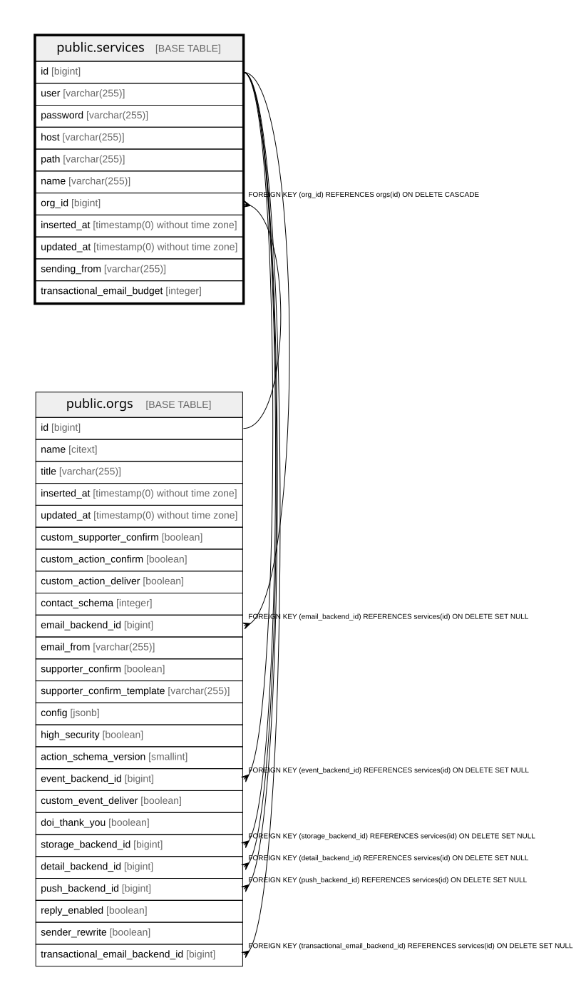

# public.services

## Description

Credentials and endpoint of a remote API an org owns. Referenced from orgs as a particular backend (email, push, storage...)

## Columns

| Name | Type | Default | Nullable | Children | Parents | Comment |
| ---- | ---- | ------- | -------- | -------- | ------- | ------- |
| id | bigint | nextval('services_id_seq'::regclass) | false | [public.orgs](public.orgs.md) |  |  |
| user | varchar(255) | ''::character varying | false |  |  | Account id, client id, or whatever credential the service uses |
| password | varchar(255) | ''::character varying | false |  |  | Secret credential (password, key, token) |
| host | varchar(255) | ''::character varying | false |  |  | Hostname, or a type-specific container: for AWS it holds the region |
| path | varchar(255) |  | true |  |  | Type-dependent resource selector, e.g. AWS bucket name or URL path |
| name | varchar(255) |  | false |  |  | Service type/provider (Enums.ExternalService), e.g. mailjet, webhook, ses |
| org_id | bigint |  | false |  | [public.orgs](public.orgs.md) |  |
| inserted_at | timestamp(0) without time zone |  | false |  |  |  |
| updated_at | timestamp(0) without time zone |  | false |  |  |  |
| sending_from | varchar(255) |  | true |  |  | Verified sending address used as envelope From when rewriting the sender (SRS); falls back to orgs.email_from |
| transactional_email_budget | integer |  | true |  |  | How many transactional emails to route via this service before falling back to email_backend; NULL means no limit |

## Constraints

| Name | Type | Definition |
| ---- | ---- | ---------- |
| services_host_not_null | n | NOT NULL host |
| services_id_not_null | n | NOT NULL id |
| services_inserted_at_not_null | n | NOT NULL inserted_at |
| services_name_not_null | n | NOT NULL name |
| services_org_id_not_null | n | NOT NULL org_id |
| services_password_not_null | n | NOT NULL password |
| services_updated_at_not_null | n | NOT NULL updated_at |
| services_user_not_null | n | NOT NULL "user" |
| services_org_id_fkey | FOREIGN KEY | FOREIGN KEY (org_id) REFERENCES orgs(id) ON DELETE CASCADE |
| services_pkey | PRIMARY KEY | PRIMARY KEY (id) |

## Indexes

| Name | Definition |
| ---- | ---------- |
| services_pkey | CREATE UNIQUE INDEX services_pkey ON public.services USING btree (id) |
| services_org_id_index | CREATE INDEX services_org_id_index ON public.services USING btree (org_id) |

## Relations

---

> Generated by [tbls](https://github.com/k1LoW/tbls)
