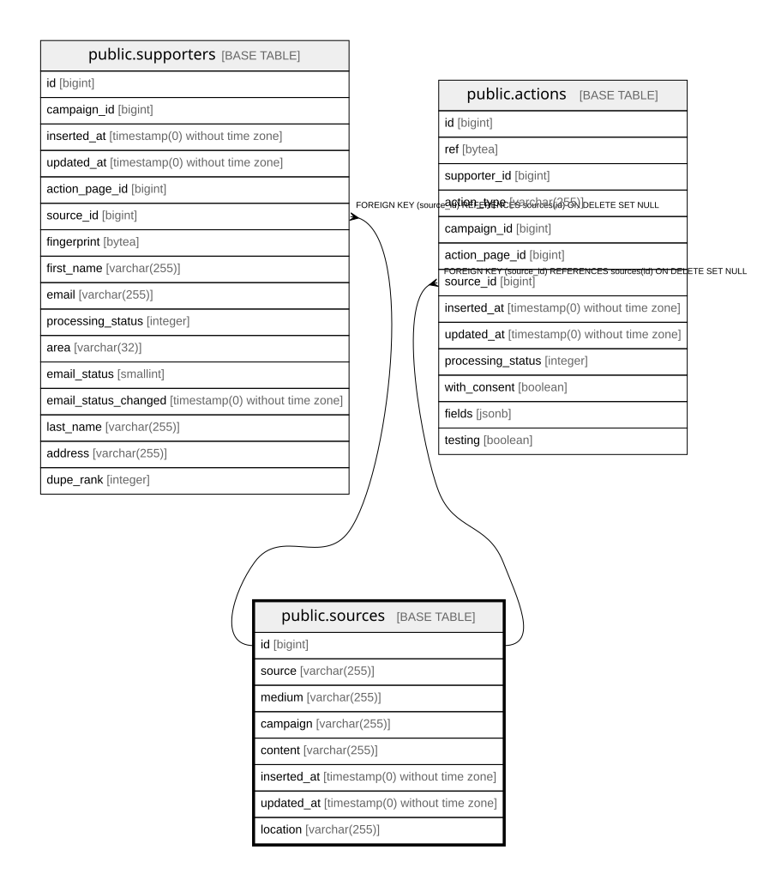

# public.sources

## Description

Deduplicated tracking tuple (utm_*) and widget location, attached to a supporter or action

## Columns

| Name | Type | Default | Nullable | Children | Parents | Comment |
| ---- | ---- | ------- | -------- | -------- | ------- | ------- |
| id | bigint | nextval('sources_id_seq'::regclass) | false | [public.supporters](public.supporters.md) [public.actions](public.actions.md) |  |  |
| source | varchar(255) |  | false |  |  |  |
| medium | varchar(255) |  | false |  |  |  |
| campaign | varchar(255) |  | false |  |  | utm_campaign value; not a reference to campaigns |
| content | varchar(255) |  | false |  |  |  |
| inserted_at | timestamp(0) without time zone |  | false |  |  |  |
| updated_at | timestamp(0) without time zone |  | false |  |  |  |
| location | varchar(255) | ''::character varying | false |  |  | utm_location value; empty string when the widget did not report one |

## Constraints

| Name | Type | Definition |
| ---- | ---- | ---------- |
| sources_campaign_not_null | n | NOT NULL campaign |
| sources_content_not_null | n | NOT NULL content |
| sources_id_not_null | n | NOT NULL id |
| sources_inserted_at_not_null | n | NOT NULL inserted_at |
| sources_location_not_null | n | NOT NULL location |
| sources_medium_not_null | n | NOT NULL medium |
| sources_source_not_null | n | NOT NULL source |
| sources_updated_at_not_null | n | NOT NULL updated_at |
| sources_pkey | PRIMARY KEY | PRIMARY KEY (id) |

## Indexes

| Name | Definition |
| ---- | ---------- |
| sources_pkey | CREATE UNIQUE INDEX sources_pkey ON public.sources USING btree (id) |
| sources_source_medium_campaign_content_location_index | CREATE UNIQUE INDEX sources_source_medium_campaign_content_location_index ON public.sources USING btree (source, medium, campaign, content, location) |

## Relations

---

> Generated by [tbls](https://github.com/k1LoW/tbls)
