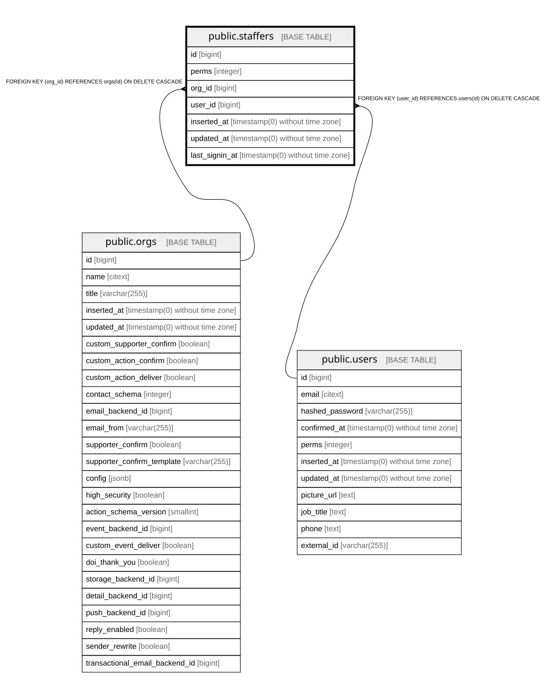

# public.staffers

## Description

Membership of a user in an org, with that user's role/permissions in the org

## Columns

| Name | Type | Default | Nullable | Children | Parents | Comment |
| ---- | ---- | ------- | -------- | -------- | ------- | ------- |
| id | bigint | nextval('staffers_id_seq'::regclass) | false |  |  |  |
| perms | integer | 0 | false |  |  | Permission bit flags of this user in this org (see Proca.Staffer.Role) |
| org_id | bigint |  | false |  | [public.orgs](public.orgs.md) |  |
| user_id | bigint |  | false |  | [public.users](public.users.md) |  |
| inserted_at | timestamp(0) without time zone |  | false |  |  |  |
| updated_at | timestamp(0) without time zone |  | false |  |  |  |
| last_signin_at | timestamp(0) without time zone |  | true |  |  | Last time the user signed in while acting as this org |

## Constraints

| Name | Type | Definition |
| ---- | ---- | ---------- |
| staffers_id_not_null | n | NOT NULL id |
| staffers_inserted_at_not_null | n | NOT NULL inserted_at |
| staffers_org_id_not_null | n | NOT NULL org_id |
| staffers_perms_not_null | n | NOT NULL perms |
| staffers_updated_at_not_null | n | NOT NULL updated_at |
| staffers_user_id_not_null | n | NOT NULL user_id |
| staffers_org_id_fkey | FOREIGN KEY | FOREIGN KEY (org_id) REFERENCES orgs(id) ON DELETE CASCADE |
| staffers_pkey | PRIMARY KEY | PRIMARY KEY (id) |
| staffers_user_id_fkey | FOREIGN KEY | FOREIGN KEY (user_id) REFERENCES users(id) ON DELETE CASCADE |

## Indexes

| Name | Definition |
| ---- | ---------- |
| staffers_pkey | CREATE UNIQUE INDEX staffers_pkey ON public.staffers USING btree (id) |
| staffers_org_id_user_id_index | CREATE UNIQUE INDEX staffers_org_id_user_id_index ON public.staffers USING btree (org_id, user_id) |

## Relations

---

> Generated by [tbls](https://github.com/k1LoW/tbls)
