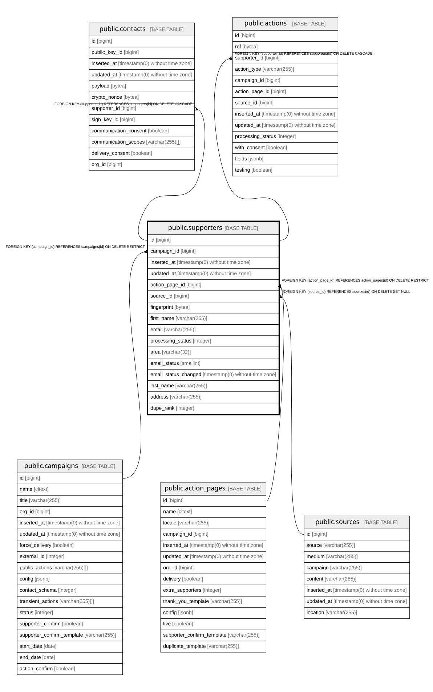

# public.supporters

## Description

One submission by a person. Never updated: repeat submissions create new rows linked by fingerprint. No durable PII here - the email/name/address copies are transient, kept while the action is being processed and cleared at delivery; durable PII lives in contacts

## Columns

| Name | Type | Default | Nullable | Children | Parents | Comment |
| ---- | ---- | ------- | -------- | -------- | ------- | ------- |
| id | bigint | nextval('signatures_id_seq'::regclass) | false | [public.contacts](public.contacts.md) [public.actions](public.actions.md) |  |  |
| campaign_id | bigint |  | false |  | [public.campaigns](public.campaigns.md) |  |
| inserted_at | timestamp(0) without time zone |  | false |  |  |  |
| updated_at | timestamp(0) without time zone |  | false |  |  |  |
| action_page_id | bigint |  | false |  | [public.action_pages](public.action_pages.md) |  |
| source_id | bigint |  | true |  | [public.sources](public.sources.md) |  |
| fingerprint | bytea |  | false |  |  | Hash of the person's identifying data; rows sharing a fingerprint are the same person |
| first_name | varchar(255) |  | true |  |  | Kept for email personalisation; by default it survives delivery and is only cleared for high_security orgs. Durable PII lives in contacts |
| email | varchar(255) |  | true |  |  | Transient: used to send confirmation and thank-you email during processing, cleared at delivery (kept for MTT campaigns, which email supporters later). Durable PII lives in contacts |
| processing_status | integer | 0 | false |  |  | State: 0 new, 1 confirming (awaiting double opt-in or moderation), 2 rejected (not counted), 3 accepted (valid, counted). Enums.SupporterProcessingStatus |
| area | varchar(32) |  | true |  |  | Area recorded on the action; kept because statistics need it and it is not PII |
| email_status | smallint | 0 | false |  |  | Deliverability and opt-in state, shared by all orgs holding this supporter: 0 none (unknown), 1 double_opt_in (consented), 2 bounce, 3 blocked, 4 spam, 5 unsub, 6 inactive (do not contact), 7 active. Enums.EmailStatus |
| email_status_changed | timestamp(0) without time zone |  | true |  |  | When email_status last changed; decides whether a status event is emitted |
| last_name | varchar(255) |  | true |  |  | Transient: cleared at delivery (kept for MTT campaigns, which need names to send later). Durable PII lives in contacts |
| address | varchar(255) |  | true |  |  | Transient: cleared at delivery (kept for MTT campaigns, which need it to send later). Durable PII lives in contacts |
| dupe_rank | integer |  | true |  |  | 0 for the first submission by this person on the page, N for the Nth duplicate |

## Constraints

| Name | Type | Definition |
| ---- | ---- | ---------- |
| signatures_action_page_id_not_null | n | NOT NULL action_page_id |
| signatures_id_not_null | n | NOT NULL id |
| signatures_inserted_at_not_null | n | NOT NULL inserted_at |
| signatures_updated_at_not_null | n | NOT NULL updated_at |
| supporters_campaign_id_not_null | n | NOT NULL campaign_id |
| supporters_email_status_not_null | n | NOT NULL email_status |
| supporters_fingerprint_not_null | n | NOT NULL fingerprint |
| supporters_processing_status_not_null | n | NOT NULL processing_status |
| supporters_campaign_id_fkey | FOREIGN KEY | FOREIGN KEY (campaign_id) REFERENCES campaigns(id) ON DELETE RESTRICT |
| supporters_action_page_id_fkey | FOREIGN KEY | FOREIGN KEY (action_page_id) REFERENCES action_pages(id) ON DELETE RESTRICT |
| supporters_pkey | PRIMARY KEY | PRIMARY KEY (id) |
| supporters_source_id_fkey | FOREIGN KEY | FOREIGN KEY (source_id) REFERENCES sources(id) ON DELETE SET NULL |

## Indexes

| Name | Definition |
| ---- | ---------- |
| supporters_pkey | CREATE UNIQUE INDEX supporters_pkey ON public.supporters USING btree (id) |
| supporters_campaign_id_index | CREATE INDEX supporters_campaign_id_index ON public.supporters USING btree (campaign_id) |
| supporters_action_page_id_index | CREATE INDEX supporters_action_page_id_index ON public.supporters USING btree (action_page_id) |
| supporters_processing_status_index | CREATE INDEX supporters_processing_status_index ON public.supporters USING btree (processing_status) |
| supporters_fingerprint_index | CREATE INDEX supporters_fingerprint_index ON public.supporters USING btree (fingerprint) |
| supporters_dupe_rank_index | CREATE INDEX supporters_dupe_rank_index ON public.supporters USING btree (dupe_rank) |

## Relations

---

> Generated by [tbls](https://github.com/k1LoW/tbls)
