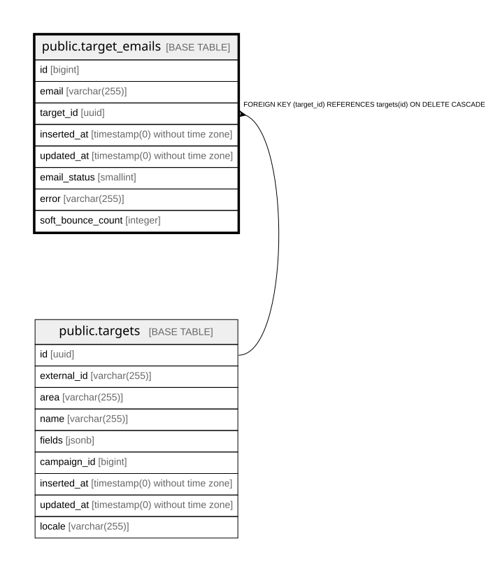

# public.target_emails

## Description

Email addresses of a target, with the deliverability state of each address

## Columns

| Name | Type | Default | Nullable | Children | Parents | Comment |
| ---- | ---- | ------- | -------- | -------- | ------- | ------- |
| id | bigint | nextval('target_emails_id_seq'::regclass) | false |  |  |  |
| email | varchar(255) |  | true |  |  |  |
| target_id | uuid |  | false |  | [public.targets](public.targets.md) |  |
| inserted_at | timestamp(0) without time zone |  | false |  |  |  |
| updated_at | timestamp(0) without time zone |  | false |  |  |  |
| email_status | smallint | 0 | false |  |  | Deliverability of this address: 0 none (not tried yet), 2 bounce, 3 blocked, 4 spam, 5 unsub, 7 active (last delivery succeeded). Enums.EmailStatus |
| error | varchar(255) |  | true |  |  | Last delivery error reported by the mail provider |
| soft_bounce_count | integer | 0 | false |  |  | Consecutive soft bounces; address is marked bounced once the threshold is passed |

## Constraints

| Name | Type | Definition |
| ---- | ---- | ---------- |
| target_emails_email_status_not_null | n | NOT NULL email_status |
| target_emails_id_not_null | n | NOT NULL id |
| target_emails_inserted_at_not_null | n | NOT NULL inserted_at |
| target_emails_soft_bounce_count_not_null | n | NOT NULL soft_bounce_count |
| target_emails_target_id_not_null | n | NOT NULL target_id |
| target_emails_updated_at_not_null | n | NOT NULL updated_at |
| target_emails_target_id_fkey | FOREIGN KEY | FOREIGN KEY (target_id) REFERENCES targets(id) ON DELETE CASCADE |
| target_emails_pkey | PRIMARY KEY | PRIMARY KEY (id) |

## Indexes

| Name | Definition |
| ---- | ---------- |
| target_emails_pkey | CREATE UNIQUE INDEX target_emails_pkey ON public.target_emails USING btree (id) |
| target_emails_target_id_index | CREATE INDEX target_emails_target_id_index ON public.target_emails USING btree (target_id) |

## Relations

---

> Generated by [tbls](https://github.com/k1LoW/tbls)
