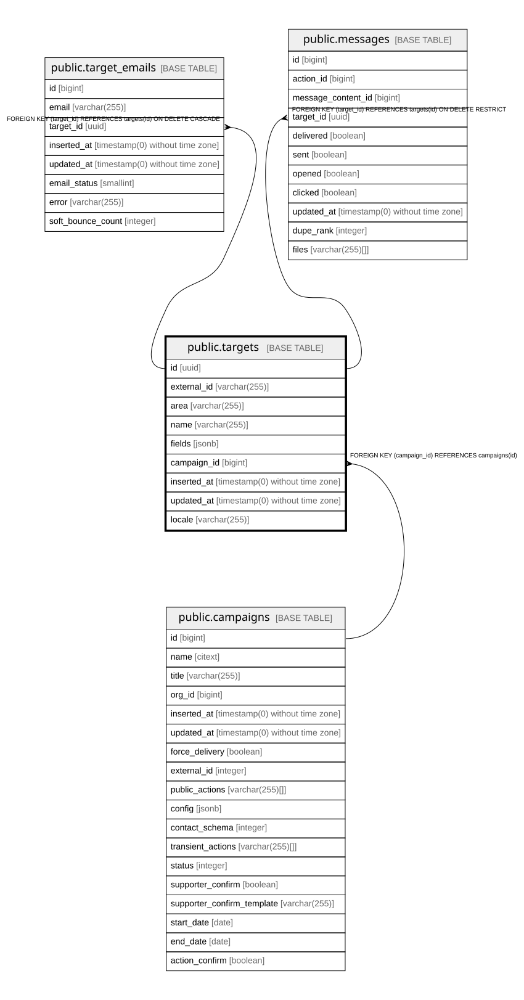

# public.targets

## Description

Campaign target supporters can send MTT messages to (e.g. an MP, a company)

## Columns

| Name | Type | Default | Nullable | Children | Parents | Comment |
| ---- | ---- | ------- | -------- | -------- | ------- | ------- |
| id | uuid |  | false | [public.target_emails](public.target_emails.md) [public.messages](public.messages.md) |  |  |
| external_id | varchar(255) |  | false |  |  | Stable id from the target list, used to upsert targets |
| area | varchar(255) |  | true |  |  | Area the target belongs to, for filtering message lists |
| name | varchar(255) |  | true |  |  |  |
| fields | jsonb | '{}'::jsonb | false |  |  | Free-form target attributes imported from the target list |
| campaign_id | bigint |  | true |  | [public.campaigns](public.campaigns.md) |  |
| inserted_at | timestamp(0) without time zone |  | false |  |  |  |
| updated_at | timestamp(0) without time zone |  | false |  |  |  |
| locale | varchar(255) |  | true |  |  | Language to use for messages to this target |

## Constraints

| Name | Type | Definition |
| ---- | ---- | ---------- |
| max_fields_size | CHECK | CHECK ((pg_column_size(fields) <= 5120)) |
| targets_external_id_not_null | n | NOT NULL external_id |
| targets_fields_not_null | n | NOT NULL fields |
| targets_id_not_null | n | NOT NULL id |
| targets_inserted_at_not_null | n | NOT NULL inserted_at |
| targets_updated_at_not_null | n | NOT NULL updated_at |
| targets_campaign_id_fkey | FOREIGN KEY | FOREIGN KEY (campaign_id) REFERENCES campaigns(id) |
| targets_pkey | PRIMARY KEY | PRIMARY KEY (id) |

## Indexes

| Name | Definition |
| ---- | ---------- |
| targets_pkey | CREATE UNIQUE INDEX targets_pkey ON public.targets USING btree (id) |
| targets_external_id_index | CREATE UNIQUE INDEX targets_external_id_index ON public.targets USING btree (external_id) |
| targets_campaign_id_index | CREATE INDEX targets_campaign_id_index ON public.targets USING btree (campaign_id) |

## Relations

---

> Generated by [tbls](https://github.com/k1LoW/tbls)
