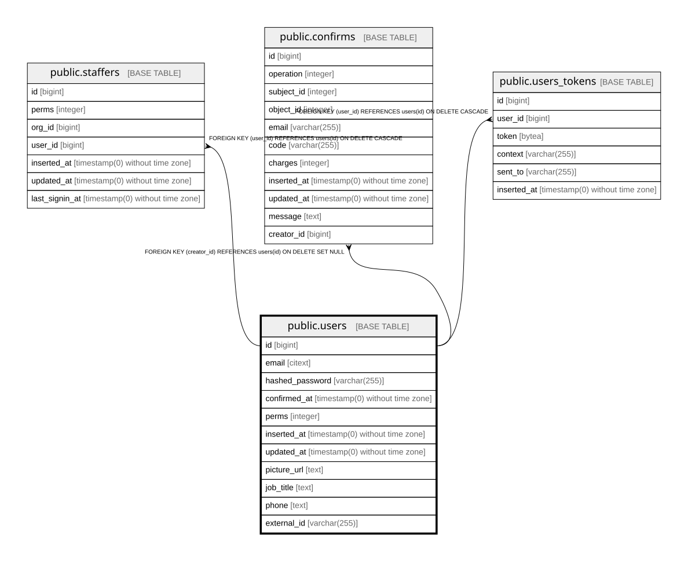

# public.users

## Description

Instance user account; authentication only. Org membership lives in staffers

## Columns

| Name | Type | Default | Nullable | Children | Parents | Comment |
| ---- | ---- | ------- | -------- | -------- | ------- | ------- |
| id | bigint | nextval('users_id_seq'::regclass) | false | [public.staffers](public.staffers.md) [public.confirms](public.confirms.md) [public.users_tokens](public.users_tokens.md) |  |  |
| email | citext |  | false |  |  |  |
| hashed_password | varchar(255) |  | false |  |  | Password hash; never the password itself |
| confirmed_at | timestamp(0) without time zone |  | true |  |  |  |
| perms | integer | 0 | false |  |  | Instance-level permission flags |
| inserted_at | timestamp(0) without time zone |  | false |  |  |  |
| updated_at | timestamp(0) without time zone |  | false |  |  |  |
| picture_url | text |  | true |  |  |  |
| job_title | text |  | true |  |  |  |
| phone | text |  | true |  |  |  |
| external_id | varchar(255) |  | true |  |  | Same user in an external identity provider; used to match them on login |

## Constraints

| Name | Type | Definition |
| ---- | ---- | ---------- |
| users_email_not_null1 | n | NOT NULL email |
| users_hashed_password_not_null | n | NOT NULL hashed_password |
| users_id_not_null1 | n | NOT NULL id |
| users_inserted_at_not_null1 | n | NOT NULL inserted_at |
| users_perms_not_null1 | n | NOT NULL perms |
| users_updated_at_not_null1 | n | NOT NULL updated_at |
| users_pkey | PRIMARY KEY | PRIMARY KEY (id) |

## Indexes

| Name | Definition |
| ---- | ---------- |
| users_pkey | CREATE UNIQUE INDEX users_pkey ON public.users USING btree (id) |
| users_email_index | CREATE UNIQUE INDEX users_email_index ON public.users USING btree (email) |
| users_external_id_index | CREATE UNIQUE INDEX users_external_id_index ON public.users USING btree (external_id) |

## Relations

---

> Generated by [tbls](https://github.com/k1LoW/tbls)
