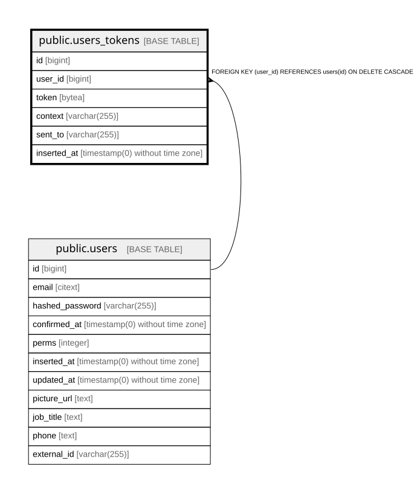

# public.users_tokens

## Description

Issued session and email tokens for a user

## Columns

| Name | Type | Default | Nullable | Children | Parents | Comment |
| ---- | ---- | ------- | -------- | -------- | ------- | ------- |
| id | bigint | nextval('users_tokens_id_seq'::regclass) | false |  |  |  |
| user_id | bigint |  | false |  | [public.users](public.users.md) |  |
| token | bytea |  | false |  |  | Hashed token; the plaintext is only ever sent to the user |
| context | varchar(255) |  | false |  |  | What the token is for, e.g. session or reset_password |
| sent_to | varchar(255) |  | true |  |  | Address the token was delivered to when sent out of band |
| inserted_at | timestamp(0) without time zone |  | false |  |  |  |

## Constraints

| Name | Type | Definition |
| ---- | ---- | ---------- |
| users_tokens_context_not_null | n | NOT NULL context |
| users_tokens_id_not_null | n | NOT NULL id |
| users_tokens_inserted_at_not_null | n | NOT NULL inserted_at |
| users_tokens_token_not_null | n | NOT NULL token |
| users_tokens_user_id_not_null | n | NOT NULL user_id |
| users_tokens_user_id_fkey | FOREIGN KEY | FOREIGN KEY (user_id) REFERENCES users(id) ON DELETE CASCADE |
| users_tokens_pkey | PRIMARY KEY | PRIMARY KEY (id) |

## Indexes

| Name | Definition |
| ---- | ---------- |
| users_tokens_pkey | CREATE UNIQUE INDEX users_tokens_pkey ON public.users_tokens USING btree (id) |
| users_tokens_user_id_index | CREATE INDEX users_tokens_user_id_index ON public.users_tokens USING btree (user_id) |
| users_tokens_context_token_index | CREATE UNIQUE INDEX users_tokens_context_token_index ON public.users_tokens USING btree (context, token) |

## Relations

---

> Generated by [tbls](https://github.com/k1LoW/tbls)
