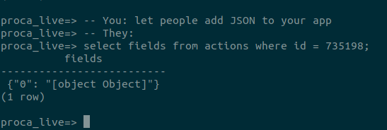

# Design Principles

## Be versatile

- Be able to accept a wide range of inputs - also future ones.
- Do not limit the supported action types. 
- Do not limit the sets of personal data collected.
- Allow adding custom fields.

#### Examples 
- The contact (personal information) can be composed of different sets of data-points: first name, last name, email, postcode; or: these + address; or: names + address + national id (no email); or: names + phone number + postcode.
- Any given action type is accepted
- Special actions like donation can be given `data` field with opaque donation processor data (Stripe PaymentIntent).

## Guarantee consistency

- When given input is required for performing server side operation (in Proca server, microservice, or CMS), guarantee its consistency (data type, presence, format etc).
- When input is not so required, allow passing it as "opaque" data. 
- Even with opaque or unstructured data, care must be taken not to break/crash the action data processing pipeline (microservices, queue processors and ultimately CRM system).
- Even with opaque or unstructured data, limits must be set not to allow trashing of unreasonable amount of data into the processing system (eg 10MB file content).
- Assume that every opaque/JSON-bag data will eventually contain trash and do not rely on it.
  
  Such data can be passed around and queried to implement convenience features, but not critical ones.
 
#### Examples:

- When email is required to sync to a CRM, it is required and must be well formatted.
- Donation action amount must be present and a number to be able to calculate fundraised total.
- If birth data is given in context of personal data, it must be ISO formatted.

## Include batteries 

- Provide functionality that is expected of an action tool, such as: send thank you emails, handle double opt-in, support making donations using most popular global payment processing, send mail to target, provide most popular sync methods out of the box.
- Proca is primarily meant to be a complete action tool (without a CMS and CRM), to provide functionality that correctly guides the member action data between campaign website (CMS) and member action database (CRM). You can use Proca as a "dumb" pass-through and implement all the functionality you need in CMS and CRM, but this is not the principal and intended use of Proca (it would be simpler to just send data straight to CRM instead of using Proca as proxy).

#### Examples 

- Send thank you emails when email backend and template is configured.
- Hold on processing of personal data when double opt in is needed, and send double opt in email.
- Sync data to AWS SQS .
- Marking custom fileds as public you can display last comments on your website, or last open letter signatories, by pulling data straight from Proca.
- Get most popular stats straight from proca (action counts, supporter total, supporters per area).

## Be extensible

- Expose pluggable interfaces so missing functionality or integrations can be implemented as an external service.
- Allow for implementing novel action types on top of Proca. 
- Expose all management functions via API.

#### Examples 

- Implement real-time voting system for members watching a debate by using actions as yes/no vote and action pages for different questions, use campaign stats API to fetch results.
- Expose rabbitmq queue to send double opt in from another system, but still use "hold on" mechanism to not sync.
- Add action data programmatically using API (not widget).
- Process donation using a 3rd party processor and still pass donaton data through Proca.

## Respect privacy

- Separate contact data (personal information) from rest of action data 
- Encrypt contact data using public key cryptography
- Minimize the stored clear-text data on a need-to-know basis 
- Only provide data to organisation if there is a purpose for processing, such as (1. email opt-in or 2. signature delivery to authority/decisionmaker).

#### Examples 

- Keep member email in clear only if it is needed to send thank you email, or MTT, and remove it as soon as these actions are done
- If member signs at partner website, but does not opt in to leader, and the partner is the delivering party, the leader will no receive members data.
- If member signs at partner website, does not opt in to leader, but the leader is marked as delivering party, both will get data (partner for purpose of opt-in, leader for purpose of delivery)

